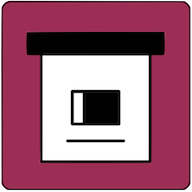

<div align="center">

<p><sub>YOUR WEB, PRESERVED.</sub></p>
<h1>ArchiveBox for Android</h1>
<p><strong>Keep the good parts of the web.</strong><br>Share a link. Add your tags. Find it again.<br>A native Android companion for your own ArchiveBox server.</p>
<p><a href="https://github.com/ArchiveBox/android-archivebox/releases/latest/download/ArchiveBox-Android.apk"></a></p>
<p><a href="LICENSE"></a>   <a href="https://github.com/ArchiveBox/android-archivebox/stargazers"></a></p>
<p><a href="https://archivebox.github.io/android-archivebox/">Website</a> &nbsp; · &nbsp; <a href="#get-started">Get started</a> &nbsp; · &nbsp; <a href="https://archivebox.github.io/android-archivebox/screenshots/">Screenshots</a> &nbsp; · &nbsp; <a href="https://github.com/ArchiveBox/android-archivebox/issues">Feedback</a></p>
<sub>Android 9+ · Requires a reachable ArchiveBox server · Google Play listing not yet available</sub>
</div>

<br>

**[ArchiveBox](https://archivebox.io/) saves copies of websites so you can revisit them after they change or disappear.** ArchiveBox for Android brings saving, search, and your collection to your phone and tablet. The server stores the archive; the app keeps it close.

- 📥 **Share it. Keep it.** Send links from browsers, messages, and other apps through Android’s share menu.
- 🏷️ **A place for every link.** Add tags as you save, with suggestions from your server and recent tags.
- 🔎 **Find your way back.** Search saved pages, open archived captures, and share original or archived links.
- 🗂️ **Your whole collection.** Open snapshots, crawls, tags, personas, users, and administration tools in the app.
- 🔑 **Your server, your choice.** Connect by URL and API key; look for nearby servers on port `5759` or check tailnet hostnames.
- 🎨 **At home on Android.** Kotlin, Jetpack Compose, Material 3, light and dark themes, and navigation that adapts to wider screens.

This is a new Android implementation. See [feature parity](docs/PARITY.md) for what is native, what uses your server’s web interface, and what remains outside the initial scope. Build and device acceptance are tracked in [validation notes](docs/VALIDATION.md).

## Get started

1. **Install the beta.** Download [ArchiveBox-Android.apk](https://github.com/ArchiveBox/android-archivebox/releases/latest/download/ArchiveBox-Android.apk) from GitHub Releases. Android may ask you to allow installation from your browser. Release downloads appear after the first successful signed release.
2. **Choose a home for your archive.** Run [ArchiveBox Server](https://github.com/ArchiveBox/ArchiveBox/wiki/Quickstart) on your computer, home server, or hosting provider. Already set up? Choose **I already have a server** in the first-run guide.
3. **Connect.** Open **Connection Settings**, enter a server URL and API key, and verify the connection. Use the address reachable from your phone; `localhost` refers to the phone itself.
4. **Save your first link.** In your browser or another app, tap **Share → ArchiveBox**, add tags, and save. Open Search or Snapshots to find it after the server finishes archiving.

The app is a client. Your server must be awake and reachable for saving, search, and browsing. ArchiveBox server features and administration permissions determine which server pages are available.

## A better share flow

Share one URL or several links as text. Review them before saving, choose existing tags or create new ones, and select a persona when your server has one configured. A successful submission means the server accepted the archive request; the server may still be capturing the pages.

Android intents support incoming shared text and app links. Long-press the launcher icon for quick actions. See the actual [intent filters](app/src/main/AndroidManifest.xml) and [shortcut definitions](app/src/main/res/xml/shortcuts.xml) when integrating another app.

## Connect nearby or over your tailnet

**Connection Settings → Discover servers** checks nearby candidates on port **5759**. Discovery identifies servers; it does not send your API key to discovered addresses. Select a result, then authenticate with that server.

For Tailscale, connect your Android device to your tailnet first and enter a server’s MagicDNS name or `100.x.y.z` address as a discovery hint. The app cannot retrieve a complete peer list from the separate Tailscale Android app. Only reachable candidates can be discovered, and a firewall or VPN policy can block access. You can always enter a server address directly, including a different port.

Prefer HTTPS for servers outside a trusted private network. See [privacy and connection behavior](docs/PRIVACY.md).

## Screenshots that follow each release

The [screenshot gallery](https://archivebox.github.io/android-archivebox/screenshots/) covers every major flow: setup, connections, discovery, library, search, snapshots, adding URLs, tags, sharing, save confirmation, activity, settings, and server pages.

Release automation captures the running Android app and rebuilds the GitHub Pages gallery from that capture set. Images carry their app version, commit, device, dimensions, and checksums in a downloadable manifest. The site build refuses incomplete or stale release captures. No design mockups stand in for app screenshots.

## Build from source

Install JDK 17 and the Android SDK components required by [the app build](app/build.gradle.kts). Use Android Studio to import this repository, or:

```sh
git clone https://github.com/ArchiveBox/android-archivebox.git
cd android-archivebox
./gradlew :app:assembleDebug :app:testDebugUnitTest :app:lintDebug
./gradlew :app:installDebug
```

Set `ANDROID_HOME` or create a local `local.properties` with `sdk.dir` pointing to your SDK. Connect an Android 9+ device with USB debugging enabled, or start an emulator before installing. Do not commit API keys, `local.properties`, or signing files.

- [Release and signing setup](docs/RELEASES.md) — automatic main-branch versions, APK/AAB publishing, and Google Play prerequisites.
- [Website and screenshot contract](docs/WEBSITE.md) — preview the site and maintain capture coverage.
- [Feature parity](docs/PARITY.md) · [Validation](docs/VALIDATION.md) · [Privacy](docs/PRIVACY.md) · [Branding credits](docs/BRANDING.md).

## Help & feedback

- 📖 [ArchiveBox documentation](https://github.com/ArchiveBox/ArchiveBox/wiki) — running a server, archiving, and managing your collection.
- 💬 [Community forum](https://zulip.archivebox.io/) — ask questions and share your workflow.
- 🐛 [Report an Android issue](https://github.com/ArchiveBox/android-archivebox/issues) — include Android version, app version, and the steps that failed. Remove credentials from logs and screenshots.

Free and open source under the [GNU GPL v3 only](LICENSE). Copyright © 2026 ArchiveBox contributors.

<p align="center"><a href="https://archivebox.io/">ArchiveBox Server</a> &nbsp; · &nbsp; <a href="https://app.archivebox.io/">Apple apps</a> &nbsp; · &nbsp; <a href="https://electron.archivebox.io/">Desktop app</a> &nbsp; · &nbsp; <a href="https://extension.archivebox.io/">Browser extension</a> &nbsp; · &nbsp; <a href="https://github.com/sponsors/pirate">Support the project ♡</a><br><sub>Your data. Your devices. Your archive.</sub></p>
